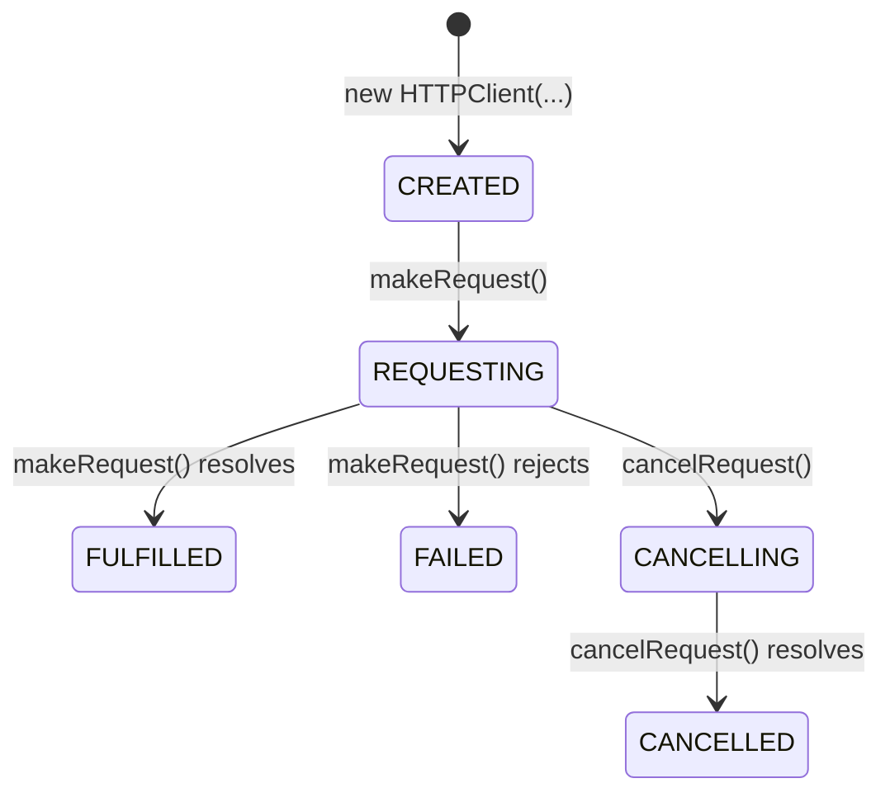

# Promise-based HTTP and HTTPS client for Node.js

[](https://opensource.org/licenses/MIT)

The `http-client` module provides simple and intuitive methods for making HTTP requests. The client supports both HTTP and HTTPS protocols and is designed to work seamlessly with modern JavaScript features such as `async`/`await`.

Key features:

- Promise-based methods for easy asynchronous programming
- Support for both HTTP and HTTPS protocols
- Automatic conversion of request and response bodies to and from JSON
- The HTTP request can be cancelled in flight
- Comprehensive error handling with custom error classes

## Table of Contents

- [Installation](#installation)
- [Usage](#usage)
	- [Basic Usage](#basic-usage)
	- [Cancelling the Request](#cancelling-the-request)
	- [Advanced Usage](#advanced-usage)
- [HTTP Client States](#http-client-states)
- [The `HTTPClient` Class](#the-httpclient-class)
	- [Static Properties](#static-properties)
	- [Instance Properties](#instance-properties)
	- [Instance Methods](#instance-methods)
- [The `HTTPResponse` Class](#the-httpresponse-class)
	- [Static Properties](#static-properties-1)
	- [Instance Properties](#instance-properties-1)
	- [Instance Methods](#instance-methods-1)
- [Testing](#testing)
- [Contributing](#contributing)
- [License](#license)

## Installation

You can install this module via `npm`:

```shell
npm install @jfabello/http-client
```

## Usage

To use the `http-client` module, first import it into your code and then create an instance of the `HTTPClient` class.

### Basic Usage

```javascript
const { HTTPClient } = require("@jfabello/http-client");

async function someAsyncFunction() {
	// Create a new HTTP Client instance
	let httpClient = new HTTPClient("https://www.example.com/");

	// Make the HTTP request
	let httpClientResponse = await httpClient.makeRequest();

	console.log(`HTTP server response: ${httpClientResponse.statusCode}`);
}

someAsyncFunction();
```

### Cancelling the Request

```javascript
const { HTTPClient } = require("@jfabello/http-client");

async function someAsyncFunction() {
	// Create a new HTTP Client instance
	let httpClient = new HTTPClient("https://www.example.com/");

	// Make the HTTP request
	let httpClientPromise = httpClient.makeRequest();

	// Do something else before the HTTP request is fulfilled...

	// Cancel the HTTP request before it is fulfilled
	httpClient.cancelRequest();

	// Wait for the HTTP request to be cancelled
	try {
		await httpClientPromise;
	} catch (error) {
		if (error instanceof HTTPClient.errors.ERROR_HTTP_REQUEST_CANCELLED === true) {
			console.log("The HTTP request was cancelled");
		} else {
			console.error("An unkown error has occurred");
		}
	}
}

someAsyncFunction();
```

### Advanced Usage

```javascript
const { HTTPClient } = require("@jfabello/http-client");

async function someAsyncFunction() {
	// Create a new HTTP Client instance
	let httpClient = new HTTPClient("http://www.example.com/api/v1/createuser", {
		method: "POST",
		headers: {
			"API-Key": "cHakuK4TrOs3NLxlsltR",
			"Accept": "application/json",
			"Content-Type": "application/json"
		},
		timeout: 60 * 1000,
		body: {
			firstName: "John",
			lastName: "Doe",
			username: "jdoe",
			email: "jdoe@example.com"
		}
	});

	// Make the HTTP request
	let httpClientResponse = await httpClient.makeRequest();

	if (httpClientResponse.statusCode === 200 && "result" in httpClientResponse.body) {
		console.log(`User created: ${httpClientResponse.body.result}`);
	}
}

someAsyncFunction();
```

## HTTP Client States

The `HTTPClient` class provides the following states:



## The `HTTPClient` Class

### Static Properties

- `CREATED`: Read-only property representing the `CREATED` state.
- `REQUESTING`: Read-only property representing the `REQUESTING` state.
- `CANCELLING`: Read-only property representing the `CANCELLING` state.
- `FULFILLED`: Read-only property representing the `FULFILLED` state.
- `CANCELLED`: Read-only property representing the `CANCELLED` state.
- `FAILED`: Read-only property representing the `FAILED` state.
- `errors`: Read-only property that contains the HTTP client error classes as properties.

### Instance Properties

- `state`: Read-only property that contains the current state of the HTTP client instance.

### Instance Methods

#### `constructor()`

Creates a new instance of the HTTP Client.

##### Parameters

- `url`: The URL of the HTTP request.
- `options`: An optional object that contains the HTTP client options.
	- `method`: An optional string that specifies the HTTP request method. Can be `GET`, `POST`, `PUT`, `DELETE`, `PATCH` or `HEAD`. The default is `GET`.
	- `headers`: An optional key-value pairs object that specifies the HTTP request headers.
	- `timeout`: An optional positive integer that specifies the HTTP request timeout in milliseconds. The default is 60 seconds.
	- `body`: An optional string, serializable object or Buffer object that specifies the HTTP request body.
	- `bodyEncoding`: An optional string that specifies the HTTP request body encoding. The default is UTF-8.
	- `autoJSONResponseParse`: An optional boolean that specifies if the HTTP response body should be automatically parsed as JSON. The default is `true`.

##### Throws

- `ERROR_HTTP_REQUEST_URL_TYPE_INVALID`: If the URL argument is not a string or URL object.
- `ERROR_HTTP_REQUEST_URL_STRING_INVALID`: If the URL argument string is not a valid URL.
- `ERROR_HTTP_REQUEST_URL_PROTOCOL_INVALID`: If the URL protocol specified in the URL argument is not HTTP or HTTPS.
- `ERROR_HTTP_REQUEST_METHOD_TYPE_INVALID`: If the HTTP request method option is not a string.
- `ERROR_HTTP_REQUEST_METHOD_INVALID`: If the HTTP request method option is not a valid HTTP method.
- `ERROR_HTTP_REQUEST_HEADERS_TYPE_INVALID`: If the HTTP request headers option is not an object.
- `ERROR_HTTP_REQUEST_TIMEOUT_TYPE_INVALID`: If the HTTP request timeout option is not an integer.
- `ERROR_HTTP_REQUEST_TIMEOUT_OUT_OF_BOUNDS`: If the HTTP request timeout option is less than 1 millisecond.
- `ERROR_HTTP_REQUEST_BODY_TYPE_INVALID`: If the HTTP request body option is not a string or an object.
- `ERROR_HTTP_REQUEST_BODY_ENCODING_TYPE_INVALID`: If the HTTP request body encoding option is not a string.
- `ERROR_HTTP_REQUEST_BODY_ENCODING_INVALID`: If the HTTP body encoding option is not a valid encoding.
- `ERROR_AUTO_JSON_RESPONSE_PARSE_OPTION_TYPE_INVALID`: If the autoJSONResponseParse option is not a boolean.

#### `makeRequest()`

Executes the HTTP request. If the request is in the `REQUESTING` state, it returns the existing promise.

##### Returns

A promise that fulfills to an HTTP Response object if the HTTP request is performed succesfully, or rejects to an error if the HTTP request fails.

##### Throws

- `ERROR_HTTP_REQUEST_MAKE_REQUEST_UNAVAILABLE`: If the HTTP client is not in a state that allows making HTTP requests.
- `ERROR_HTTP_REQUEST_TIMED_OUT`: If the HTTP request times out while making the request.
- `ERROR_HTTP_REQUEST_BODY_TYPE_INVALID`: If the HTTP request body type is not supported.
- `ERROR_HTTP_RESPONSE_TIMED_OUT`: If the HTTP request times out while waiting for a response.
- `ERROR_HTTP_RESPONSE_BODY_NOT_PARSEABLE_AS_JSON`: If the HTTP response body cannot be parsed as JSON. 
- `ERROR_HTTP_REQUEST_CANCELLED`: If the HTTP request is cancelled.
- `ERROR_UNKNOWN`: If an unknown error occurs.

This instance method can also throw a POSIX error if the underlying `http` or `https` module throws an error.

#### `cancelRequest()`

Requests the cancellation of the the HTTP request. If the request is in the `CANCELLING` state, it returns the existing promise.

#### Returns

A promise that fulfills to `true` when the HTTP request is successfully cancelled.

#### Throws

- `ERROR_HTTP_REQUEST_CANCEL_UNAVAILABLE`: If the HTTP client is not in a state that allows requesting the HTTP request cancellation.

## The `HTTPResponse` Class

### Static Properties

- `errors`: Read-only property that contains the HTTP response error classes as properties.

### Instance Properties

- `headers`: A key-value pairs object that specifies the HTTP response headers.
- `statusCode`: A positive integer that specifies the HTTP response status code.
- `statusMessage`: A string that specifies the HTTP response status message.
- `body`: An optional object parsed from JSON or a Buffer object that specifies the HTTP response body.

### Instance Methods

#### `constructor()`

Creates a new instance of the HTTP response class.

##### Parameters

- `headers`: A key-value pairs object that specifies the HTTP response headers.
- `statusCode`: A positive integer that specifies the HTTP response status code.
- `statusMessage`: A string that specifies the HTTP response status message.
- `body`: An optional object parsed from JSON or a Buffer object that specifies the HTTP response body.

##### Throws

- `ERROR_HTTP_RESPONSE_HEADERS_TYPE_INVALID`: If the HTTP response headers type is not an object.
- `ERROR_HTTP_RESPONSE_STATUS_CODE_TYPE_INVALID`: If the HTTP response status code type is not an integer.
- `ERROR_HTTP_RESPONSE_STATUS_CODE_OUT_OF_BOUNDS`: If the HTTP response status code is not between 100 and 599.
- `ERROR_HTTP_RESPONSE_STATUS_MESSAGE_TYPE_INVALID`: If the HTTP response status message type is not a string.
- `ERROR_HTTP_RESPONSE_BODY_TYPE_INVALID`: If the HTTP response body type is not an object.

## Testing

To run the tests for this module, first clone the repository using the following command:

```shell
git clone https://github.com/jfabello/http-client.git
```

Then, navigate to the project directory and install the npm dependencies, this will install the Jest testing framework and the HTTP Test Server:

```shell
cd http-client
npm install
```

Finally, run the tests using the following command:

```shell
npm test
```

## Contributing

Unfortunately, we are not able to accept contributions at this time.

If you find a bug in the code, please open an issue.

Thank you for your understanding.

## License

This project is licensed under the MIT License. See the [LICENSE](LICENSE) file for details.
